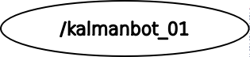
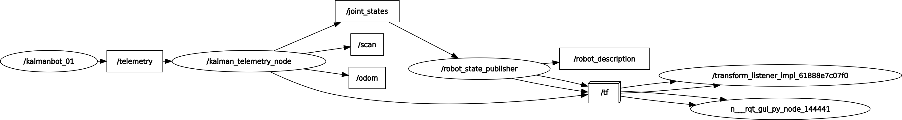
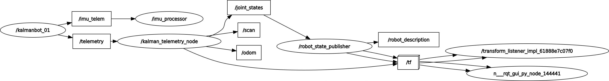

# Kit de robótica de bajo costo y open source de [Kalman Robotics](https://kalmanrobotics.io/)

- [Kit de robótica de bajo costo y open source de Kalman Robotics](#kit-de-robótica-de-bajo-costo-y-open-source-de-kalman-robotics)
  - [Presentación](#presentación)
  - [Características principales del robot](#características-principales-del-robot)
  - [Cómo funciona internamente la conectividad entre el robot y la computadora?](#cómo-funciona-internamente-la-conectividad-entre-el-robot-y-la-computadora)
  - [Qué aplicaciones se pueden hacer con el robot?](#qué-aplicaciones-se-pueden-hacer-con-el-robot)
    - [Teleoperación](#teleoperación)
    - [Algortimos variados](#algortimos-variados)
    - [Mapeo 2D](#mapeo-2d)
    - [Navegación autónoma](#navegación-autónoma)
    - [Mucho más ...](#mucho-más-)
  - [REPOSITORIOS de software](#repositorios-de-software)
    - [Software principal del kit](#software-principal-del-kit)
    - [Recursos adicionales](#recursos-adicionales)
    - [Dependencias personalizadas (incluídas en los repositorios principales)](#dependencias-personalizadas-incluídas-en-los-repositorios-principales)
  - [Redes Sociales](#redes-sociales)

## Presentación
[Kalman Robotics](https://kalmanrobotics.io/) con el objetivo de fomentar la educación y la investigación en robótica móvil, ha desarrollado un kit de robótica de **bajo costo** y **open source**. Este kit está diseñado para ser accesible para estudiantes, educadores e investigadores, proporcionando una plataforma versátil para aprender y experimentar con robótica móvil. [Presentación Canva del Kit.](https://www.canva.com/design/DAG5KX8kaVM/EGcQhmG82Dps6QZfn75TnA/view?utm_content=DAG5KX8kaVM&utm_campaign=designshare&utm_medium=link2&utm_source=uniquelinks&utlId=h2c5431ab82)

> Si estás interesado en adquirir el kit, aprender más de robótica, ROS2 y micro-ROS, visita nuestra [plataforma educativa](https://kalmanrobotics.io/).

## Características principales del robot
El robot se encuentra conformado por los siguientes componentes principales:

- **Microcontrolador**: ESP32-S3
- **PCB con drivers de motor integrados**
- **Sensores**:
  - LiDAR 360° 
  - Encoders en ruedas
  - IMU 6DOF (Acelerómetro y Giroscopio)
  - Medidor de voltaje de batería
- **Actuadores**:
  - Motores DC
  - Buzzer
  - LED
- **Comunicación**: micro-ROS sobre WiFi
- **Alimentación**: 1 Batería recargable
- **Plataforma móvil diferencial**:
  - Llantas de goma
  - Chasis de PLA
  - Rueda loca
  - Antena WiFi
- **Dimensiones compactas y diseño original**

## Cómo funciona internamente la conectividad entre el robot y la computadora?
El robot ejecuta un nodo de micro-ROS que se comunica con un agente de micro-ROS corriendo en la computadora a través de una red WiFi. Esta configuración permite enviar comandos de movimiento al robot y recibir datos de sus sensores en tiempo real. En la siguientes imágenes se observa el gráfico de nodos de RQT para una mejor comprensión de la arquitectura de software del robot:

1. **Nodo de micro-ROS en el robot ESP32-S3** (indispensable para interactuar con el robot)

2. **Nodo de telemetría y robot_state_publisher en la computadora** (requerido para obtener la lectura de sensores y estados del robot como mensajes estándar de ROS2)

3. **Nodo de teleoperación en la computadora**

4. **Nodo de sensor IMU en la computadora**

> - Las formas ovaladas representan nodos.
> - Las formas rectangulares representan tópicos (canales de comunicación entre nodos).

## Qué aplicaciones se pueden hacer con el robot?

### Teleoperación
La teleoperación es el primer paso para controlar el robot de forma remota. Utilizando el teclado de la computadora el usuario puede mover el robot en diferentes direcciones y velocidades.

Video demostrativo de teleoperación

<video controls style="width:33%;" src="https://github.com/user-attachments/assets/7aa0fbdb-eac2-4d8c-a0b1-aa40485893ad
">
  Tu navegador no soporta el elemento <code>video</code>.
</video>

### Algortimos variados
Poder comandar al robot por velocidades y conocer la lectura de los sensores permite implementar diversos algoritmos de robótica móvil, como por ejemplo:
- Evitación de obstáculos
- Seguimiento de paredes
- Búsqueda de objetivos
- Patrullaje de áreas
- Resolución de laberintos
- Y muchos más ...

### Mapeo 2D
El mapeo 2D permite al robot crear un mapa del entorno utilizando datos del sensor LiDAR. Este mapa puede ser utilizado para la navegación autónoma y otras aplicaciones.

Video demostrativo de mapeo 2D

<video controls style="width:33%;" src="GRABAR">
  Tu navegador no soporta el elemento <code>video</code>.
</video>

### Navegación autónoma
La navegación autónoma permite al robot moverse de forma independiente en su entorno, evitando obstáculos y siguiendo rutas predefinidas.

Video demostrativo de navegación autónoma

En este 1er video el robot se localiza en un mapa preexistente y mediante RVIZ se le asigna un punto objetivo al que debe llegar. Posteriormente este visualizador muestra en tiempo real la planificación de la ruta que el robot debe seguir para llegar al objetivo evitando obstáculos.

<video controls style="width:66%;" src="https://github.com/user-attachments/assets/27162948-e6a4-496f-940a-d97bb359d9fe">
  Tu navegador no soporta el elemento <code>video</code>.
</video>

En este 2do video se observa al robot real navegando de forma autónoma hacia el objetivo previamente asignado en el mapa. 

<video controls style="width:33%;" src="https://github.com/user-attachments/assets/a1f37ff9-4a41-4fec-8ec5-0f23e93b9023">
  Tu navegador no soporta el elemento <code>video</code>.
</video>

### Mucho más ...
- Integración de mandos físicos para teleoperación
- Fusión de sensores (IMU + odometría)
- Obtención de odometría basada en sensores
- Integración de algoritmos de localización
- Integración de algortimos de exploración
- Interfaz web para control y monitoreo
- Integración con asistentes de voz e IA
- Y muchos más ...

## REPOSITORIOS de software
### Software principal del kit
- [Firmware de ESP32 del robot con micro-ROS](https://github.com/Kalman-Robotics/kit-kalman-firmware)
- [Paquetes de ROS2 para computador (teleoperación, mapeo, navegación autónoma, etc)](https://github.com/Kalman-Robotics/Kit-Kalman-ROS2)

### Recursos adicionales
- [Demo de cada elemento de hardware del robot con Arduino](https://github.com/Kalman-Robotics/kit-kalman-hardware-demos)
- [Docker con paquetes de ROS2 y agente de micro-ROS preinstalados](https://github.com/Kalman-Robotics/kit-kalman-install)

### Dependencias personalizadas (incluídas en los repositorios principales)
- [Libería de Micro-ROS personalizada de Kalman Robotics](https://github.com/Kalman-Robotics/micro_ros_kalman)
- [Interfaces personalizados de Kalman Robotics](https://github.com/Kalman-Robotics/kalman_interfaces)

## Redes Sociales
- Plataforma Educativa: [kalmanrobotics.io](https://kalmanrobotics.io/)
- LinkedIn: [Kalman Robotics](https://www.linkedin.com/company/kalman-robotics/)
- GitHub: [Kalman Robotics](https://github.com/Kalman-Robotics)
<!-- - YouTube: [Kalman Robotics](https://www.youtube.com/@kalmanrobotics) -->
<!-- - Instagram: [@kalmanrobotics](https://www.instagram.com/kalmanrobotics/) -->
<!-- - Facebook: [Kalman Robotics](https://www.facebook.com/kalmanrobotics) -->
<!-- - Twitter: [@kalmanrobotics](https://twitter.com/kalmanrobotics) -->